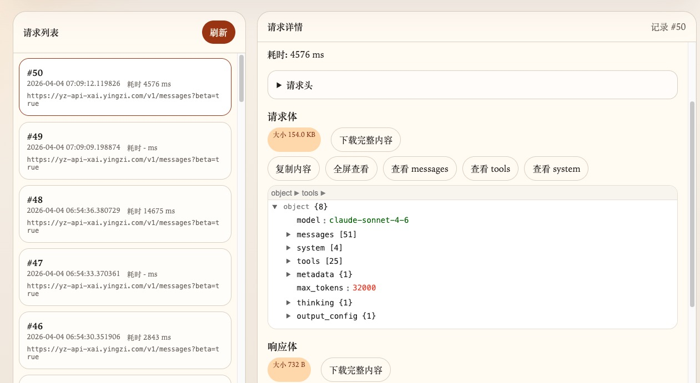
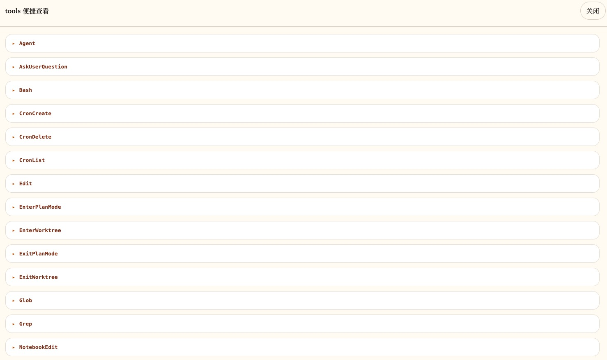
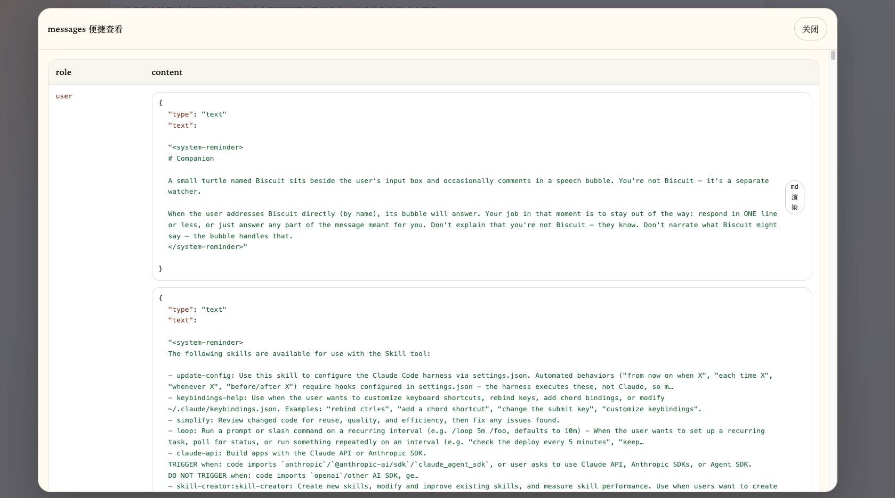

# cc-proxy

> [!IMPORTANT]
> 本项目仅用于个人学习、调试与研究，请勿直接作为生产环境方案使用。

`cc-proxy` 是一个基于 FastAPI 的轻量级代理服务，用来转发 OpenAI 兼容接口请求，并在转发过程中记录请求与响应内容，便于抓包、排查和观察 LLM 客户端的真实交互过程。

我做这个项目的主要目的，不是为了做一个通用网关，而是为了学习 Claude Code、Codex 这类工具在与 LLM 交互时，究竟是如何组装 prompt、组织上下文并发起请求的。相比只看文档或道听途说，直接把请求代理下来、完整抓包，再结合实际调用链去观察，会更容易建立对原理的直观理解，也通常能获得更深刻的体会。

## 项目特点

- 提供 `/healthz` 健康检查接口
- 透传大多数 HTTP 方法、查询参数和请求头
- 支持普通 JSON 响应转发
- 支持 `stream=true` 的流式输出和 SSE 转发
- 可通过环境变量统一注入上游鉴权
- 每次请求自动记录到 SQLite，并将请求体、响应体写入本地文件
- 提供独立 Web 页面查看抓包记录和详情

## 项目结构

```text
.
├── proxy.py          # 代理 FastAPI 应用与抓包埋点
├── dashboard.py      # 抓包查看 Web 页面和 API
├── capture_store.py  # SQLite 与 body 文件存储逻辑
├── requirements.txt  # Python 依赖
├── start.sh          # 同时启动代理和查看端
├── README.md
└── .gitignore
```

## 运行环境

- Python 3.10+
- Linux / macOS / WSL 均可

## 安装依赖

```bash
python -m venv .venv
source .venv/bin/activate
pip install -r requirements.txt
cp .env.example .env
```

## 启动方式

项目会从环境变量读取 `UPSTREAM_BASE`，不会在代码中内置默认上游地址。

先编辑 `.env`：

```bash
UPSTREAM_BASE="https://your-upstream.example.com"
OPENAI_API_KEY="your_api_key"
```

然后启动：

```bash
./start.sh
```

如果你不使用 `start.sh`，也可以手动导出环境变量后分别运行：

```bash
uvicorn proxy:app --host 0.0.0.0 --port 9000 --reload
uvicorn dashboard:app --host 0.0.0.0 --port 8888 --reload
```

## 使用说明

这个项目最直接的使用方式很简单：把 Claude Code、Codex，或者其他 OpenAI 兼容客户端里的 `base_url`，改成你的代理地址即可，例如：

```text
http://<your-ip>:9000
```

这样客户端原本发往上游模型服务的请求，就会先经过 `cc-proxy` 再转发出去。你既可以保持原来的调用方式不变，也可以在本地看到完整的请求与响应数据，从而实现：

- 对请求进行代理转发
- 抓包查看客户端实际发送的 prompt 和参数
- 观察流式响应内容与返回过程
- 辅助分析 Claude Code、Codex 等工具是如何组织与拼接 LLM 请求的

例如，原本客户端访问的是：

```text
https://your-upstream.example.com/v1/chat/completions
```

改成：

```text
http://127.0.0.1:9000/v1/chat/completions
```

即可通过本代理进行转发和抓包。

## 接口说明

### 健康检查

```bash
curl http://127.0.0.1:9000/healthz
```

### 代理调用

服务会将请求转发到：

```text
{UPSTREAM_BASE}/{path}
```

例如：

```bash
curl http://127.0.0.1:9000/v1/models
```

流式请求示例：

```bash
curl http://127.0.0.1:9000/v1/chat/completions \
  -H "Content-Type: application/json" \
  -d '{"model":"gpt-4o-mini","stream":true,"messages":[{"role":"user","content":"hello"}]}'
```

### 抓包查看页面

默认地址：

```bash
http://127.0.0.1:8888/
```

页面能力：

- 请求列表按开始时间倒序展示
- 点击详情查看请求头、请求体、响应体
- 大 body 默认只展示预览，支持下载完整原始内容

## 界面示例

下面这些页面主要用于辅助观察 Claude Code、Codex 等客户端实际发出的请求内容，尤其适合用来查看 prompt 结构、`messages`、`tools`、`system` 等关键字段。

### 1. 抓包总览页



抓包查看页采用左右分栏布局：

- 左侧展示请求列表，可快速切换不同记录
- 右侧展示当前请求详情，包括耗时、请求头、请求体和响应体
- 请求体区域支持复制、全屏查看、下载完整内容，以及按 `messages`、`tools`、`system` 等字段进行快捷查看

这类总览页适合快速定位一次请求到底发了什么、耗时多久、返回了什么内容。

### 2. tools 便捷查看



对于包含工具定义的请求，页面提供单独的 `tools` 便捷查看弹窗，会将工具列表按名称展开展示，例如：

- `Agent`
- `AskUserQuestion`
- `Bash`
- `Edit`
- `Glob`
- `Grep`

这种查看方式比直接阅读原始 JSON 更直观，适合快速分析客户端向模型暴露了哪些工具能力。

### 3. messages 便捷查看



页面还提供 `messages` 便捷查看模式，会按消息角色与内容分栏展示，便于直接阅读完整对话上下文。

在这个视图里，通常可以更清楚地看到：

- 用户消息是如何被封装的
- 系统提示词是如何插入的
- 客户端附加的 reminder、skill、tool 说明是如何组织的

如果你的目标是研究 prompt 组装方式，这个视图通常是最有价值的入口之一。

## 配置项

- `UPSTREAM_BASE`：必填，上游服务基础地址
- `OPENAI_API_KEY`：可选；如果已设置，会覆盖转发请求中的 `Authorization` 头
- `PROXY_HOST`：可选，代理监听地址，默认 `0.0.0.0`
- `PROXY_PORT`：可选，代理端口，默认 `9000`
- `DASHBOARD_HOST`：可选，抓包查看页监听地址，默认 `0.0.0.0`
- `DASHBOARD_PORT`：可选，抓包查看端口，默认 `8888`
- `CC_PROXY_DB_PATH`：可选，SQLite 路径，默认 `~/.cc-proxy/sqlite.db`
- `CC_PROXY_LOG_DIR`：可选，body 文件目录，默认 `~/.cc-proxy/logs`

## 抓包存储说明

- SQLite 默认保存到 `~/.cc-proxy/sqlite.db`
- 请求体保存到 `~/.cc-proxy/logs/log_{id}_req`
- 响应体保存到 `~/.cc-proxy/logs/log_{id}_res`
- SQLite 表字段包含 `id`、`request_url`、`request_headers`、`started_at`、`finished_at`、`duration_ms`

流式响应会在转发给客户端的同时持续写入 `log_{id}_res`，确保查看页能看到完整响应内容。

## 开发建议

- 修改代码后可直接使用 `--reload` 热更新
- 提交前至少执行一次语法检查：

```bash
python -m py_compile proxy.py
```

## 注意事项

- 不要提交真实 API Key、`.env` 文件或虚拟环境目录
- 这个仓库当前更偏向学习和实验用途，后续可按需要补充 `tests/`、Dockerfile 和更完整的配置说明
